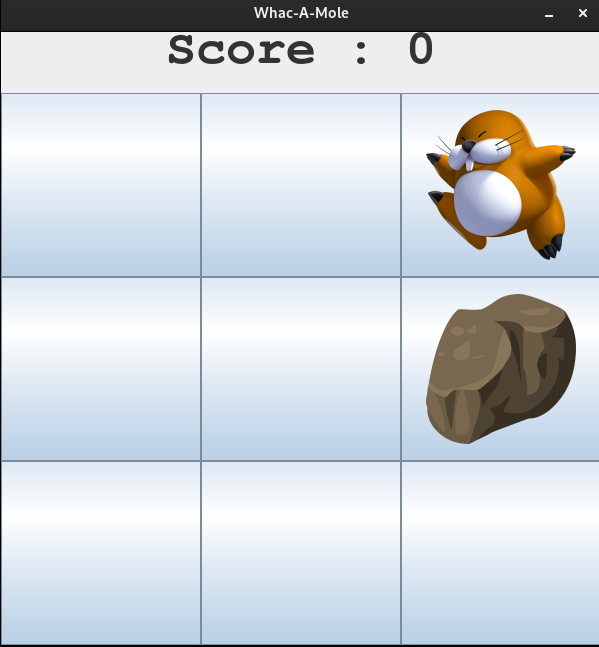
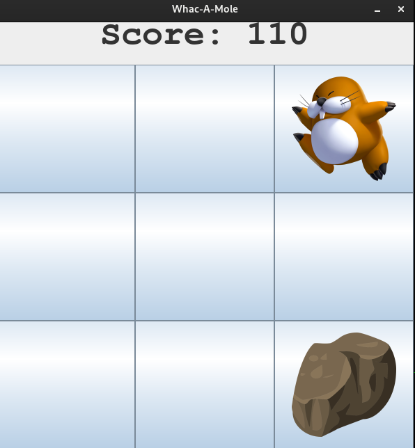
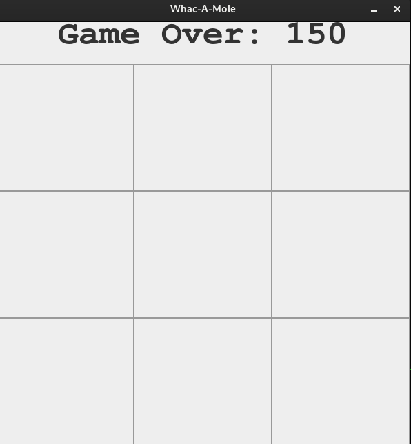

# 🛠️ Whac-A-Mole Game 🎮

## Overview

Welcome to the Whac-A-Mole Game, a fun and interactive game developed in Java. In this game, your objective is to "whack" as many moles as possible that randomly pop up in different holes within a limited time. Test your reflexes and see how many moles you can hit before the time runs out!

## 📸 Game Preview




## Features ✨ 

- Simple and Fun Gameplay: Click on the moles to score points. The more moles you hit, the higher your score!
- Randomized Mole Popups: Moles pop up at random intervals and positions, making the game challenging and unpredictable.
- Score Tracker: Keep track of your score and try to beat your personal best.
    Responsive UI: User-friendly interface with visual feedback for hits and misses.

## Technologies Used 💻

    Java: Core programming language for the game logic and UI.
    Swing: For building the graphical user interface (GUI).
    AWT: For handling events like button clicks and window actions.
    Random: For generating random positions for the moles.

# Getting Started 🚀

## Prerequisites

Make sure you have the following installed:

- Java Development Kit (JDK) (version 8 or higher)
- An IDE such as IntelliJ IDEA or Eclipse (or you can run the game directly from the terminal)

## Installation and Setup

1. Clone the repository:
```shell
git clone https://github.com/abhishekwithana/Whac-A-Mole.git
cd Whac-A-Mole
```

2. Compile the project: If you are using terminal, compile the project with:
```shell
javac App.java
```

3. Run the game: After compiling run the game
```shell
java App
```

## How to Play 🎯

    The game starts with several holes and moles popping up at random.
    Whack the mole by clicking on it as fast as you can before it disappears.
    Each successful hit increases your score.
    The game ends when the timer runs out. Your final score will be displayed.

## Screenshots 📷



